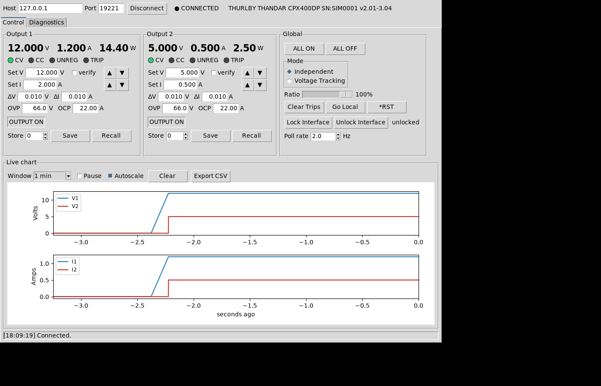
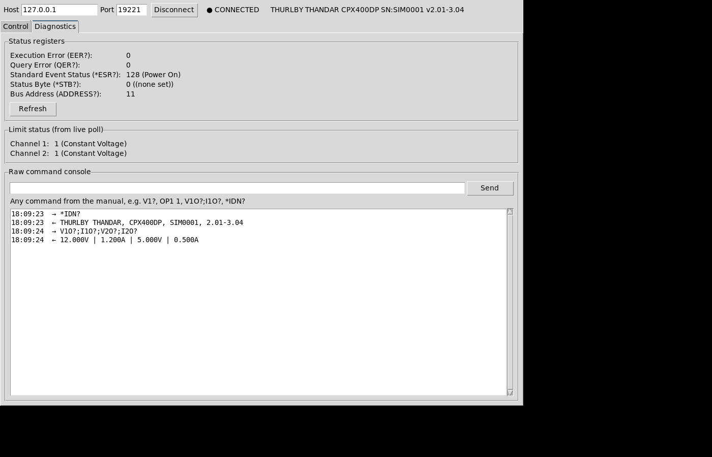
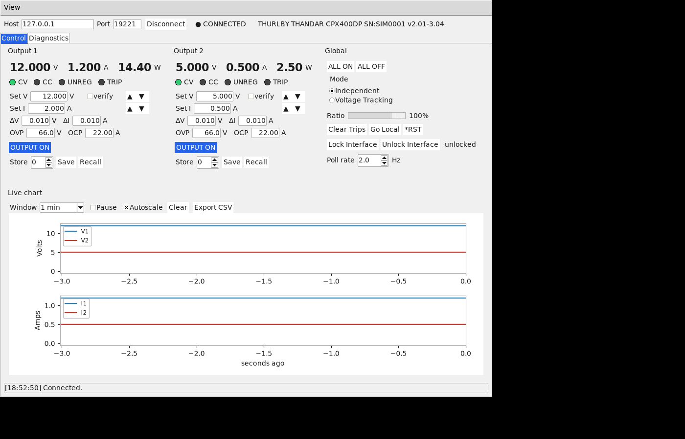
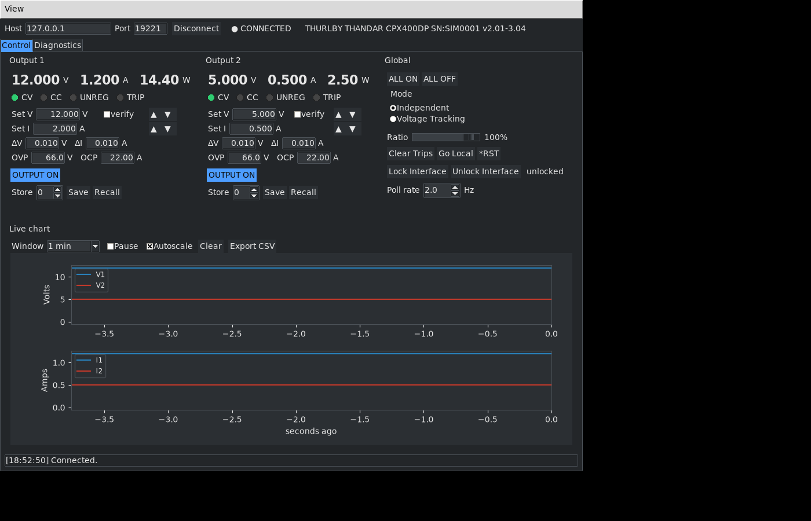
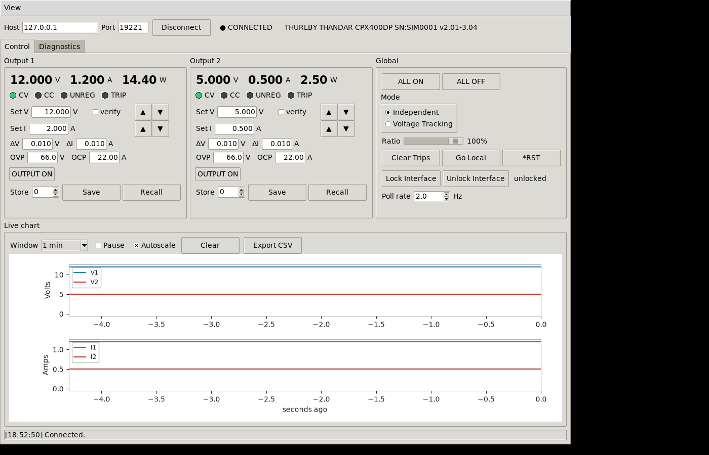

# CPX400DP LAN Control GUI

A Tk desktop application for remotely controlling an Aim-TTi CPX400DP dual-output
bench power supply over its LAN interface (raw TCP, port 9221). Live voltage/current
readback per channel, a live matplotlib history chart, and every documented remote
command exposed through the UI (plus a raw command console for anything else).

All communication with the instrument happens on a single background worker thread
(`cpx400dp/worker.py`); the Tk main thread never touches the socket.

> This project was developed with the assistance of AI, using tools including
> Claude Code, T3 Code, and Visual Studio Code.





## Themes and compact mode

The **View** menu has:

- **Theme**: Light, Dark, or System. Light/Dark are built on ttk's `clam` theme, a
  pure-Tcl theme that renders identically on Windows, macOS, and Linux — unlike
  native themes (`vista`, `aqua`), which can't be recolored. System uses the
  platform's native ttk theme as-is. The choice is remembered across restarts.
- **Compact Mode**: strips each channel down to the bare minimum — V/A readback,
  Set V, Set I, and the output switch. Everything else (mode LEDs, power, ΔV/ΔI,
  OVP/OCP, save/recall, the whole Global panel, the Diagnostics tab, and the chart)
  is hidden and the window shrinks to fit. Also remembered across restarts.

| Light | Dark |
|---|---|
|  |  |

| System | Compact Mode |
|---|---|
|  |  |

## Installation

```bash
pip install cpx400dp
```

`tkinter` is a prerequisite this can't install for you — it ships via your OS,
not PyPI. On Debian/Ubuntu: `sudo apt install python3-tk`. It's bundled with the
standard Windows and macOS Python installers.

This installs a `cpx400dp-gui` command:

```bash
cpx400dp-gui
```

## Setup from source

```bash
sudo apt install -y python3-tk python3.13-venv   # tkinter/venv are system packages, not pip
git clone https://github.com/vk5as/CPX400DP-GUI.git
cd CPX400DP-GUI
python3 -m venv --system-site-packages .venv     # --system-site-packages so the venv sees apt's tkinter
.venv/bin/pip install -e ".[dev]"
```

## Running

Against a real instrument on your LAN:

```bash
.venv/bin/python -m cpx400dp.app
```

Enter the instrument's IP (or `192.168.0.100`, the Auto-IP fallback address) and port
`9221`, then click Connect.

Against the bundled simulator (no hardware needed):

```bash
.venv/bin/python tools/fake_cpx.py --port 9221 &
.venv/bin/python -m cpx400dp.app
```

The simulator implements the documented command set with a simple resistive-load
model per channel (so CC/CV/OVP/OCP behavior is meaningful, not just an echo). Useful
flags for exercising failure paths:

```bash
.venv/bin/python tools/fake_cpx.py --port 9221 --drop-after 50   # closes the connection after 50 commands
.venv/bin/python tools/fake_cpx.py --port 9221 --slow 0.5        # artificial per-command delay
.venv/bin/python tools/fake_cpx.py --port 9221 --garbage         # occasional garbled replies
```

## Tests

```bash
.venv/bin/python -m pytest tests/ -q
```

No hardware or display required — `test_worker.py` drives the real worker thread
against `tools/fake_cpx.py` over loopback TCP.

## First connection to real hardware — safety checklist

1. Leave both outputs off. Connect the LAN cable and power on the instrument.
2. Connect from the GUI; confirm the identity string reads back the correct
   manufacturer/model/serial, and that the instrument's front panel shows **REM**.
3. Set a low voltage (e.g. 1 V) with current limit set conservatively for your load,
   *before* connecting anything to the output terminals.
4. Connect your load, enable the output, and confirm the front-panel meter and the
   GUI's readback agree.
5. When done, use **Go Local** to hand control back to the front panel. Closing the
   window does **not** turn outputs off automatically — a live load being cut without
   warning is worse than leaving it as-is. Turn outputs off explicitly first if that's
   what you want.

## Notes on the instrument's remote protocol

- Transport is a raw TCP socket on port 9221 — not SCPI-over-VXI-11 and not a
  standard SCPI-raw port. Commands are LF-terminated; replies are CR LF-terminated.
- `LSR<n>?` (limit/trip status) is **read-and-clear** on the instrument. Continuous
  polling would make trip indications flash for one cycle and vanish, so the app
  latches trip bits (OV, OC, hard-trip) until you press **Clear Trips** or the
  instrument's `TRIPRST` runs — see `cpx400dp/worker.py`'s `_latched` state.
- Changing `CONFIG` (independent vs. voltage-tracking) with an output on returns
  error 104. The app turns Output 2 off first automatically and explains why in the
  status bar.
- The instrument's own power envelope (420 W/output, with 60 V/7 A, 42 V/10 A,
  20 V/20 A boundaries) is not enforced by the instrument as a hard limit — it just
  goes unregulated outside it. The GUI warns but does not block.

## License

MIT — see [LICENSE](LICENSE).
